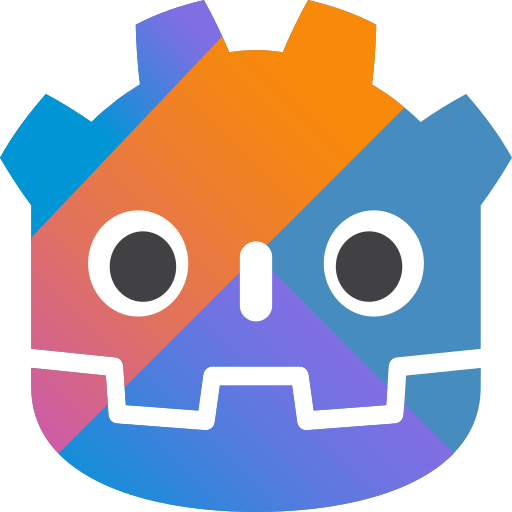

# Godot-JVM
## JVM binding for the Godot Game Engine

## Overview

This is a JVM language binding for the [**Godot**](https://godotengine.org/) game engine. It supports [**Kotlin**](https://kotlinlang.org), Java, and Scala.
It is distributed as a GDExtension addon. Install the addon in a Godot project to use these languages with the official Godot editor and export templates.

The binding provides Godot APIs for Kotlin, Java, and Scala, so you can write your game logic in the JVM language that fits your project.

You can find project examples in those repositories:

- [Minimal project template](https://github.com/utopia-rise/godot-kotlin-project-template)
- [GDQuest 3D demo converted to Kotlin](https://github.com/utopia-rise/godot-kotlin-3d-demo)

### Code Distribution

There are two methods for distributing JVM bytecode produced by the Kotlin compiler:

1.  A classic JAR file: your code will be packed into a `.jar` file, which is then executed by an embedded JVM.
    So the developer does not have to worry about their user installing a JRE. The JVM is already embedded in your game executable.
2.  Dynamic Library using GraalVM Native Image: please read more about this in our [documentation page](https://godot-jvm.dev/en/stable/user-guide/advanced/graal-vm-native-image/).

Just write your game scripts like you would for [GDScript](https://docs.godotengine.org/en/4.7/getting_started/scripting/gdscript/gdscript_basics.html)
or for [C#](https://docs.godotengine.org/en/3.1/getting_started/scripting/c_sharp/) but with all the syntactic sugar of Kotlin.

## Important Notes

Godot-JVM 1.0.0 is the first stable release. We welcome suggestions for improving the project and its API.

Download the addon archive from the [GitHub releases page](https://github.com/utopia-rise/godot-jvm/releases) and extract it into your project's root directory. The resulting layout must contain `addons/jvm/jvm.gdextension`. Open the project with the release's minimum Godot version or newer.

## Documentation

The documentation can be found [here](https://godot-jvm.dev). It's a work in progress, and we would love your input to
make it even better!

## Developer Discussion & Contribution

Join us on our [Discord](https://discord.gg/zpb5Ru7v9x) server to ask questions and work together
with a friendly community.

If you want to contribute to the project, please read through the [contribution guidelines](https://godot-jvm.dev/en/stable/contribution/guidelines/)
and the [setup](https://godot-jvm.dev/en/stable/contribution/setup/) sections.

## Partners

JetBrains is helping us to develop this project by providing development tools to maintainers.
Intellij IDEA is our IDE of choice for Kotlin development and we strongly recommend using it.

## Special thanks

We'd like to give a special thanks to [MOE](https://multi-os-engine.org/) community. They helped us a lot to get iOS
platform working. If you intend to create a multi platform mobile app (not game), check out their project.
