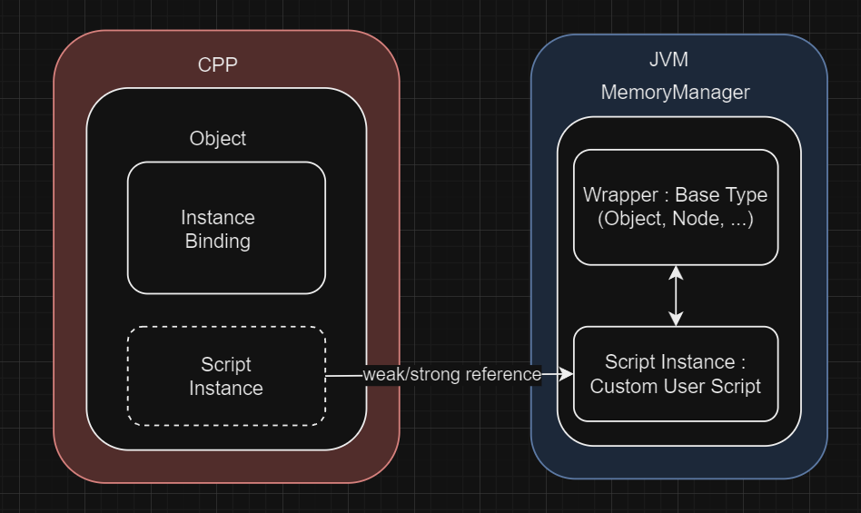

The purpose of this page is to give some clarification about how Godot and the JVM manage their memory together. 

## Regular Godot memory management
### Object and Refcounted
Godot got two ways to manage memory. Classes belonging to the `Object` category are manually freed. If not done, it will remain in memory until the program terminates and leak. To make memory management easier, another category called `Refcounted` exists. They keep an internal counter of the numbers of how many times they are references by other parts of the program. It's only when reaching 0 that it will automatically be freed from memory.

### Instance binding
Other languages can have different ways to handle memory than Godot. To help with it, Godot objects can hold `instance bindings`.  It's a set of callbacks that can be implemented by whoever wish to add a language to Godot. There are callbacks for the different phases of the lifecycle of an object: creation, destruction and counter updates. Using those callbacks, one can then synchronize the state of the Godot object with the memory of the targeted languages.

## JVM
### Garbage Collector
The JVM doesn't allow to manually manage memory. Instead, a subsystem will periodically run over the different objects in memory and check if they should be freed. The idea is similar to reference counting, as an object will be freed when it's not referenced by any other parts of the code. But unlike Reference counting it's not immediate, there is a delay before it happens as the Garbage Collector needs to run and find candidates for deletion before. All in all, it's different from the ways Godot works and require a whole system to bridge the two worlds. 

### Wrapper and Script Instance
Each time a Godot object requires some interactions with the JVM (Sent as a parameter from C++ to a Kotlin script methods, created directly by a Kotlin scripts, etc...), it needs to acquire an existence inside it. A Godot objects can be of 2 differents types within the JVM. The first is a `Wrapper`, there is a wrapper class for every Godot base type already existing in C++ (Object, Refcounted, Nodes, etc...). As the name implies, they are simply wrapping a C++ pointer and use it to call all the C++ methods the Godot object holds. The second type are the `Script Instances`, they are the custom scripts users wrote. For this type, the process is the reverse, they expose a set of Kotlin properties and methods to the C++ so they can be used by the engine like you would do with a common GDScript.

### Memory Manager
In C++ Godot, an object is 2 things, a base type and an optional script. We mirror this in the JVM with the wrappers and script instances. One major difference is that in C++, the script instance is simply a member of the base script and fake inheritance this way. In Kotlin, for technical reasons, we don't have another choice than doing true inheritance. A script instance always inherits a wrapper type. The consequences are that for a given C++ object, we can have 2 different JVM objects, each with their own lifecycle. The wrapper is bound to the Godot instance and the script instance is bound to its script. A Godot object can freely add, remove and switch script during its lifetime. In order to manage this, we have a singleton named `MemoryManager`. It got several functions:

-  Keeping an up-to-date database of all Kotlin instances, being wrapper or script instance existing in the JVM.
-  Matching any C++ pointer with an existing JVM instance (Necessary when a C++ parameter is sent to a Kotlin function)
-  Synchronizing the life of JVM and C++ instances.

It's using a container simply named `GodotBinding`, holding a reference to both wrapper and script instance (when they exist). This is this type of object that is used as an `instance binding` back in C++. This means that as long as the C++ object is alive, the JVM instances will also stay alive.

### Refcounted management
`Refcounted` objects are a bit harder to manage as they don't rely on manual management but reference counting. Kotlin instances all contribute to increase that counter, so the native object won't die as long as the JVM needs it. It's a vicious cycle because throught the binding C++ is also holding a reference to the Kotlin instance, it means they are both keeping each other alive. If kept that way, both will never be able to be freed even if unused. The solution to this is to transform the instance binding into a weak reference when the C++ side no longer use it. That way, the Godot Binding will be able to be freed by the GC When this happens, the MemoryManager will then decrement the counter of the C++ RefCounted and free it.

### Triangular references
`GodotBinding`, `Wrapper` and `Script Instance` all holds references to each other, linking their lives to each other. It's made this way because the binding is the object referenced by the C++ to keep everything alive. Conversely, any usage of the wrapper or script instance have to keep the native C++ object alive as well. 