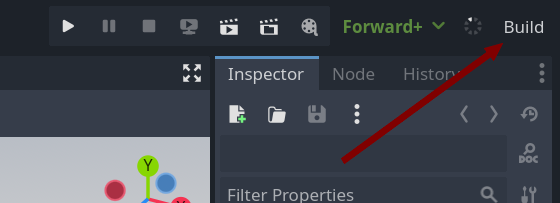
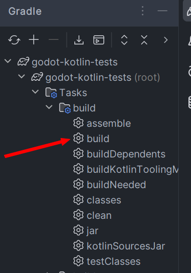

To compile your project, run a classic *Gradle build*. By default this creates a `debug` version of your code.

Using the Godot editor:



!!! warning
    On Linux or macOS you may receive an error when trying to build the project from the Godot editor (This can happen if you created your project via the IntelliJ template). 
    ```shell
    ERROR: Godot-JVM: Could not create child process: /Users/username/projectname/gradlew 
    ERROR:  at: execute_with_pipe (drivers/unix/os_unix.cpp:659)
    ```
    
    In such case, open up the terminal and change the permissions of the `gradlew` file to be executable.
    ```shell
    chmod +x gradlew
    ```

Using your IDE:



Using command-line:

/// tab | Windows
```shell
gradlew build
```
///

/// tab | Unix
```bash
./gradlew build
```
///


## Targets

We have two targets: `debug` and `release`.
In order to build in release, you should add `release` parameter to your Gradle build command.

Example:

/// tab | Windows
```shell
gradlew build -Prelease
```
///

/// tab | Unix
```bash
./gradlew build -Prelease
```
///

Using debug builds is recommended when developing. It adds some sanity checks that are cut off in `release`.  

Release builds are recommended when distributing to retail.
