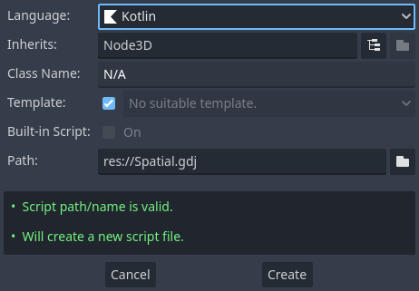

This module uses [Gradle](https://gradle.org) as its build tool and you will need version 6.0 or higher installed. The next requirement is to have a Godot project, if you don't have it yet please create one. You will also need to have Java 9 or higher installed for development. But don't worry, your users won't have to install java to use your application, this module embedds a JRE with your application. Open a terminal and `cd` to root directory of your Godot project.

## Wrapper
On this step, we will be setting up a gradle [wrapper](https://docs.gradle.org/current/userguide/gradle_wrapper.html). The wrapper will ensure that anyone who wants to build your project from source will use the same gradle version.

```shell
touch build.gradle.kts gradle.properties settings.gradle.kts
```

The above command will create three files, which will be empty for now.

```shell
gradle wrapper --gradle-version=6.8
```

That is it, you have the wrapper installed! The command will produce several files but the important ones are `gradlew` and `gradlew.bat`. Moving forward we will be using `gradlew` to run gradle (`gradlew.bat` on Windows). The first time `gradlew` is used it will download the gradle version you have specified before.

## Setup
Once you have the wrapper installed, we need to setup the Gradle plugin this module provides. Without the plugin, you will have to manually define all needed dependencies, manually register your classes, signals, properties, functions and manually create and copy the needed jar's in the correct way. To make our lives easier we use the gradle plugin which does all of this for us.
Doing this, our `build.gradle.kts` file will look like this:

```kotlin
plugins {
    kotlin("jvm") version "$kotlinVersion"
    id("com.utopia-rise.godot-jvm") version "$godotKotlinVersion"
}

repositories {
    mavenCentral()
}
```

We also want to define our project name in the `settings.gradle.kts` file:

```kotlin
rootProject.name = "$projectName"
```

Let's create a file `src/main/kotlin/com/yourcompany/game/Simple.kt` with the following content:

```kotlin
package com.yourcompany.game

import godot.Spatial
import godot.annotation.RegisterClass
import godot.annotation.RegisterFunction

@RegisterClass
class Simple: Spatial() {

    @RegisterFunction
    override fun _ready() {
        println("Hello world!")
    }
}
```

The [classes](../user-guide/classes.md) section covers in detail what we did here, but for now `@RegisterClass` will register the annotated class to Godot so Godot knows our class exist.

!!! note ""
    The plugin automatically generates the registration code which registers your class. We do not recommend that you check these files into source control.

Now we can trigger a build.

```shell
./gradlew build
```

Once the build completes, you are able to use your scripts in Godot. Simply attach the `kt` files containing registered classes to nodes like you do with GDScript. If you rebuild the project while the editor is open, your classes will be reloaded automatically in Godot and you can use them.



!!! note ""
    You can only use newly created classes after you have built them! Otherwise Godot cannot find them.

## Configuring dependencies
You can use almost the whole jvm ecosystem. Just add a dependency like you would in a normal java based project in the `build.gradle.kts`:

```kotlin
dependencies {
    implementation("joda-time:joda-time:2.10.6")
}
```
