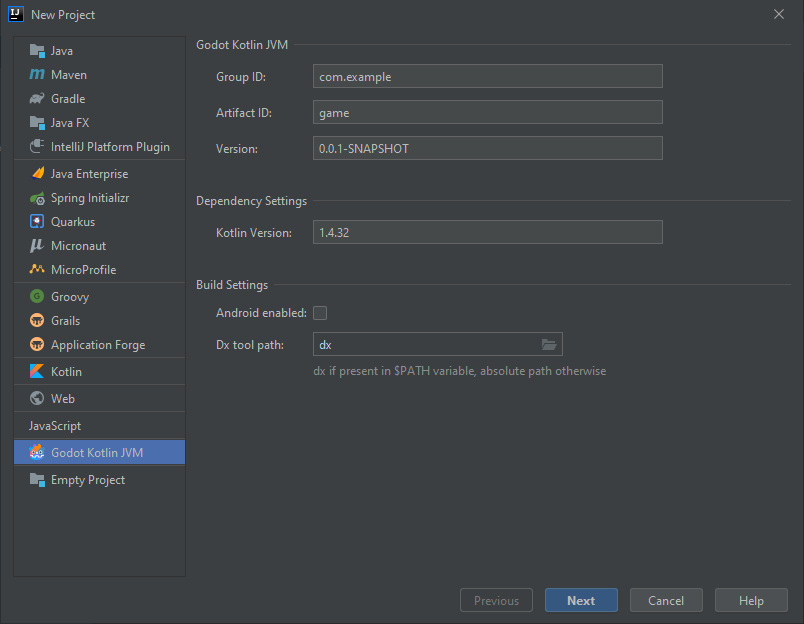
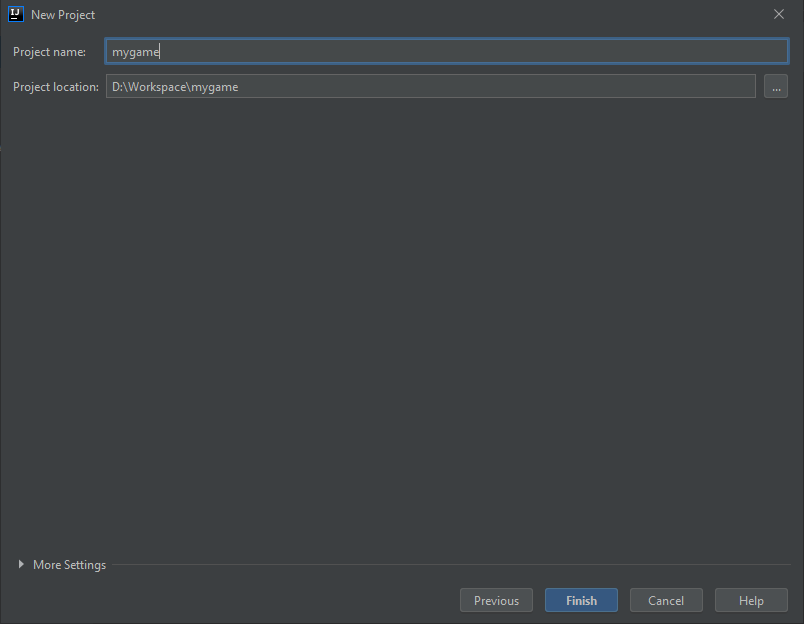
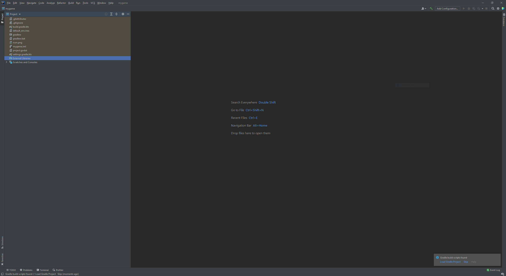

## Setting up using IntelliJ IDEA project wizard
The easiest way to setup a new project is via IntelliJ's project wizard (you need to install our IntelliJ IDEA [plugin](./requirements.md#intellij-idea-plugin)).

In IntelliJ IDEA click `New Project` and select `Godot Kotlin JVM`. Fill up the fields and click `Next` when you are done.



Select the directory where your project will be created and click `Finish`.



IntelliJ IDEA should open up your project and if you wait for a bit you should see a toast notification `Load Gradle Project` in the lower right of the window. Click that and you are ready to go!




## Setting up manually
If you do not want to use our IntelliJ IDEA plugin you can follow these steps to setup a project.

!!! note
    The following steps requires Gradle to be installed, checkout their [website](https://gradle.org) for installation instructions.

Firstly, you need to setup a gradle [wrapper](https://docs.gradle.org/current/userguide/gradle_wrapper.html). The wrapper will ensure that anyone who wants to build your project from source will use the same gradle version.

=== "Windows" 
    ```shell
    fsutil file createnew build.gradle.kts 0
    fsutil file createnew gradle.properties 0
    fsutil file createnew settings.gradle.kts 0
    ```

=== "Unix"
    ```shell
    touch build.gradle.kts gradle.properties settings.gradle.kts
    ```

The above command will create three files, which will be empty for now. 

```shell
gradle wrapper --gradle-version=6.8
```

You should have the wrapper setup after running the command above. Up next is setting up the gradle build. Open up `build.gradle.kts` and paste the following:

=== "build.gradle.kts"
    ```kt
    plugins {
        kotlin("jvm") version "$kotlinVersion"
        id("com.utopia-rise.godot-jvm") version "$godotKotlinVersion"
    }

    repositories {
        mavenCentral()
    }
    ```

!!! note 
    Replace `$kotlinVersion` and `$godotkotlinVersion` to the appropriate version you want to use.

The snippet above uses our gradle plugin. Without the plugin, you will have to manually define all needed dependencies, manually register your classes, signals, properties, functions and manually create and copy the needed jar's to the appropriate locations.
