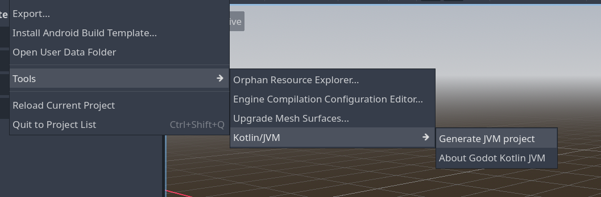
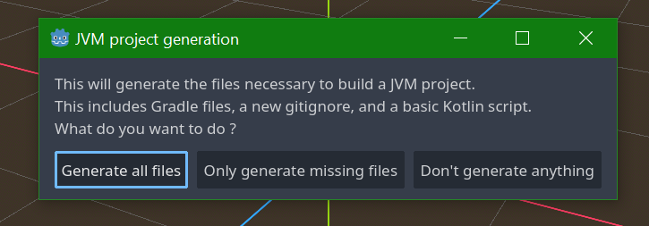
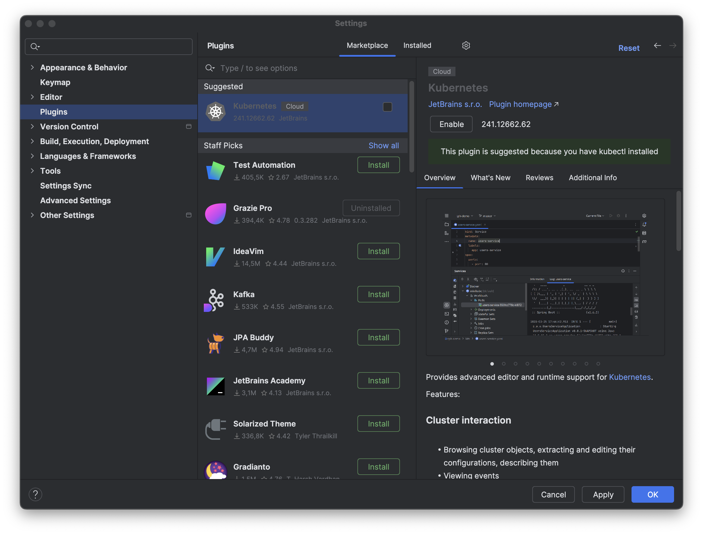
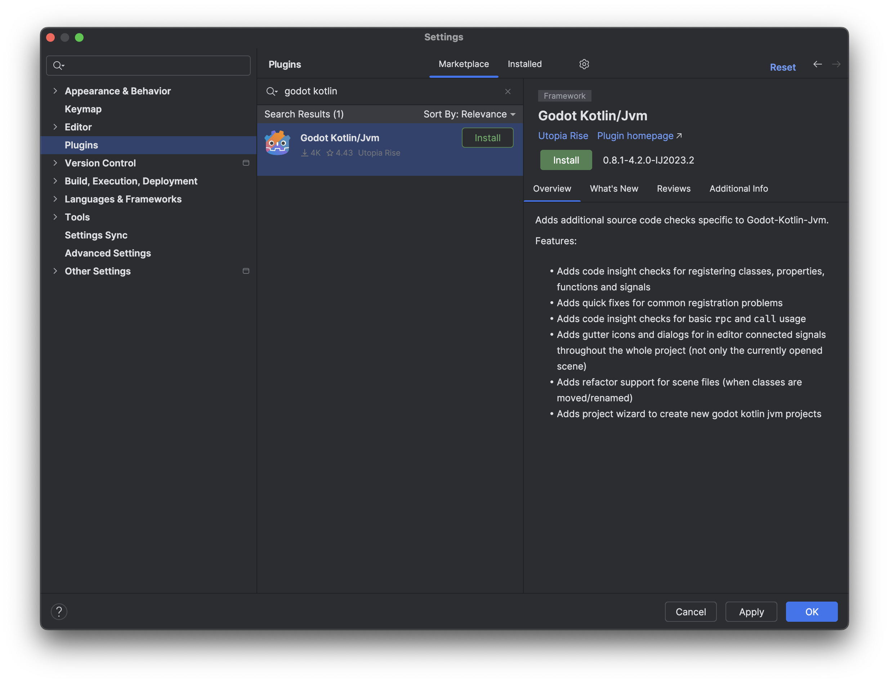
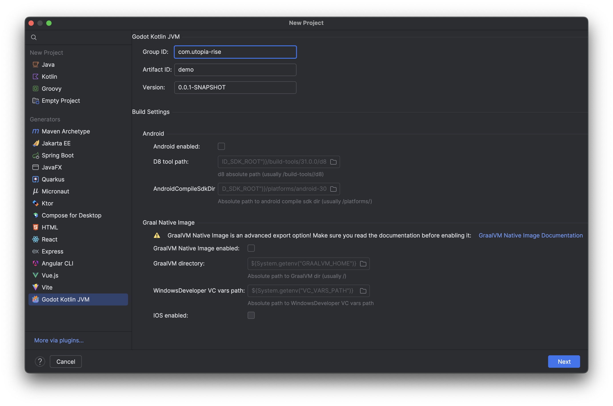
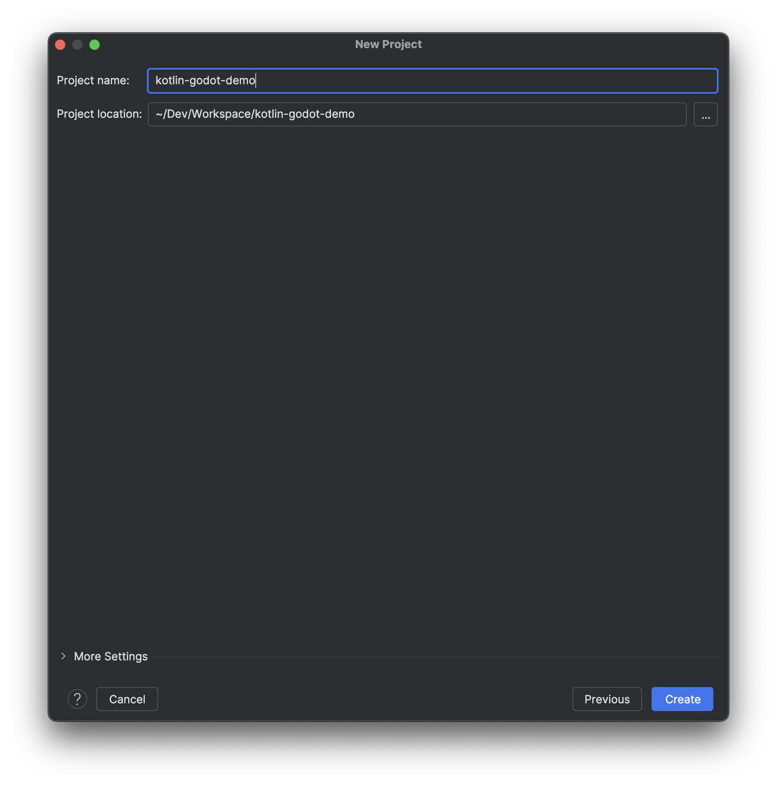
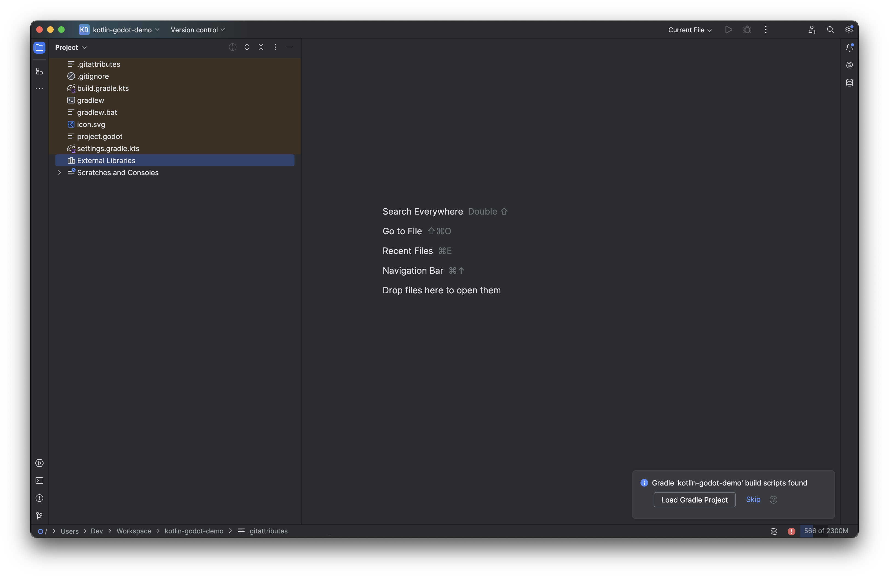
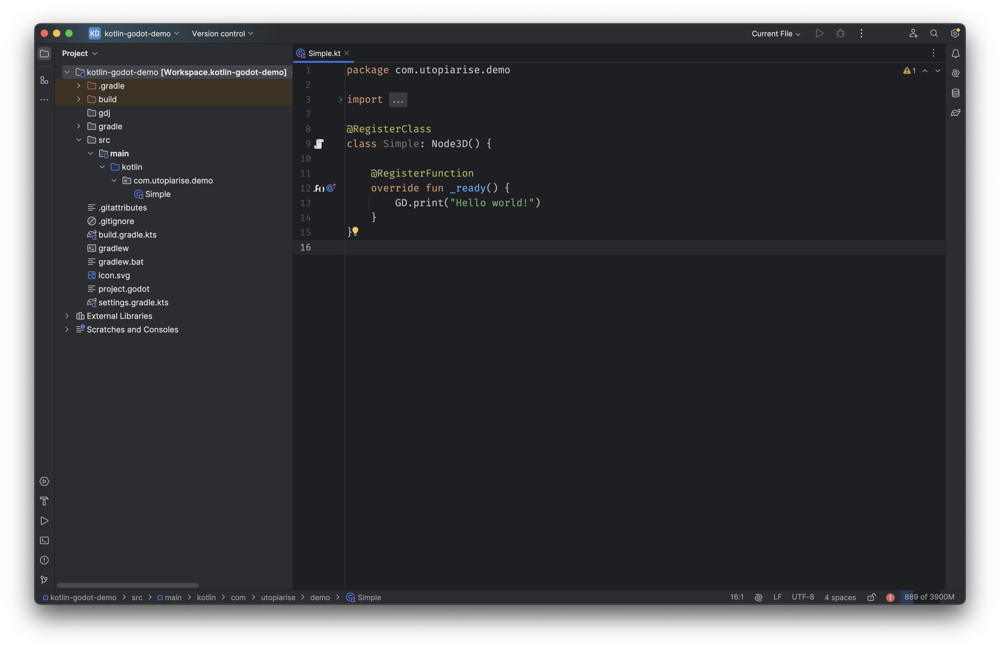

# Setting-up

This page illustrates how to set-up a project with Godot/Kotlin JVM. Currently, there are
three ways to create a new project: [directly from the Godot editor](#setting-up-using-the-godot-editor),  [using a custom IntelliJ IDEA plugin](#setting-up-using-intellij-idea-project-wizard)
or [manually](#setting-up-manually).

## Setting-up using the Godot editor.

You can simply create a regular new Godot project. 
Once done, you can go to `Project/Tools/Kotlin/JVM/Generate JVM Project`.


The following choice will appear:


## Setting-up using IntelliJ IDEA project wizard

This is the recommended solution as it creates the entire project in one action and import it in your IDE.
It's done via IntelliJ's project wizard (the user needs to install our IntelliJ IDEA [plugin](./requirements.md#intellij-idea-plugin)).

### Installing IntelliJ IDEA's plugin

To install our plugin to create new projects for Godot/Kotlin JVM, run your local copy of IntelliJ IDEA. When the editor
is running, open the `Settings` and select the `Plugins` entry. From this view, select `Marketplace` on the top-bar.



Type `godot kotlin` into the search bar, and our plugin will be shown as follows.



Click the `Install` button and wait for the IDE to download the plugin. Once the downloading
process is complete, press the `OK` button on the bottom-right. The IDE will prompt a new
alert dialog, asking the user to restart the program. To enable the plugin a full restart
is required, so please do so.

### Creating a new project

To create a new project, please refer to the following instructions:

1. Open IntelliJ IDEA
2. Create a new project clicking on `New Project`
3. In the `New Project` window, select `Godot Kotlin JVM`.
4. Fill out the package fields as necessary
5. (Optional) Select the builds that your project is interested in, such as Android or iOS.

    

    !!!note "Default Platforms"
        If the user does not select any additional platform, the plugin will not add the
        necessary files for that target. By default, the main plugin target
        is Desktop.

6. After filling all the necessary fields, click the `Next` button.
7. In the next window, choose the directory where your project will be set up.
8. Click the `Create` button. The IDE will create several files, including a Gradle build file.

    

9. IntelliJ IDEA opens up the newly created project and after a while, a toast notification
on the right-bottom will appear. To proceed forward, click on `Load Gradle Project` button.

    

    Pressing the button allows the IDE to create source files, where the user can create new scripts.

    ??? info "'GodotKotlinJvm is setting up' bar?"
        Notice that the loading process takes a bit, so, a pop-up bar will appear on top of a file's
        content. During this process, the IDE is building file inidices and it is linking the required
        dependencies. The bar will disappear automatically when the process is done.
        

10. Once the loading is complete, the user will be able to see Kotlin source code with the package
name the user inserted during the project's creation. Finally, the game development can start! 🚀



## Setting up manually

If the user does not want to use our IntelliJ IDEA plugin, then they can follow these steps to setup a project.

!!! note
    The following steps requires Gradle to be installed, checkout their [website](https://gradle.org)
    for installation instructions.

Firstly, you need to setup a Gradle [wrapper](https://docs.gradle.org/current/userguide/gradle_wrapper.html).
The wrapper will ensure that anyone who wants to build your project from source will use the same Gradle version.

=== "Windows" 
    ```shell
    fsutil file createnew build.gradle.kts 0
    fsutil file createnew gradle.properties 0
    fsutil file createnew settings.gradle.kts 0
    ```

=== "Unix"
    ```shell
    touch build.gradle.kts gradle.properties settings.gradle.kts
    ```

The above command(s) will create three empty files. As next step, type the following
command on the terminal:

```shell
gradle wrapper --gradle-version=8.1
```

After running the above command, the user should have the wrapper setup ready to be used.
Up next is setting-up the Gradle build. Now, open the `build.gradle.kts` file
and paste the following content:

=== "`build.gradle.kts`"
    ```kotlin
    plugins {
        kotlin("jvm") version "$kotlinVersion"
        id("com.utopia-rise.godot-kotlin-jvm") version "$godotKotlinVersion"
    }

    repositories {
        mavenCentral()
    }
    ```

!!! note 
    Please replace `$kotlinVersion` and `$godotkotlinVersion` to the appropriate version you want to use.

The snippet above uses our Gradle plugin. Without the plugin, the user has to manually define all needed
dependencies, manually register the classes, signals, properties, functions and manually create and copy
the needed JAR's to the appropriate locations.

## Examples

If you want to examples of what a JVM Godot project looks like, you can check the following repositories:

- [Minimal project template](https://github.com/utopia-rise/godot-kotlin-project-template)
- [GDQuest 3D demo converted to Kotlin](https://github.com/utopia-rise/godot-kotlin-3d-demo)
