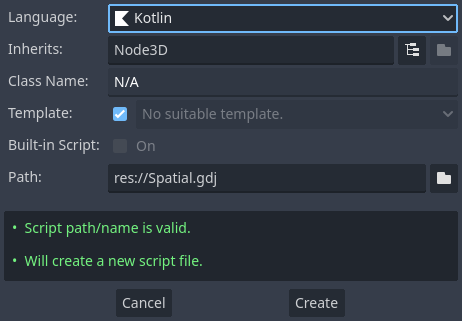

Let's create a file `src/main/kotlin/com/yourcompany/game/Simple.kt` with the following content:

```kotlin
package com.yourcompany.game

import godot.Node3D
import godot.annotation.RegisterClass
import godot.annotation.RegisterFunction
import godot.global.GD

@RegisterClass
class Simple: Node3D() {

    @RegisterFunction
    override fun _ready() {
        GD.print("Hello world!")
    }
}
```

The [classes](../user-guide/classes.md) section covers in detail what we did here, but for now `@RegisterClass` will register the class to Godot. Now we can trigger a build.

```shell
./gradlew build
``` 

Once the build completes, you will be able to use your class in Godot. Simply attach the generated `gdj` file (you'll learn what this file is in the [user guide](../user-guide/api-differences.md)) to a node like you would do in GDScript. If you rebuild the project while the editor is open, your classes will be reloaded automatically in Godot and you can use them.



!!! info
    As Kotlin is a compiled language you can only use newly created classes after you have built them, otherwise, Godot will not be able to find them.

## Configuring dependencies
The majority of the JVM ecosystem is at your disposal, just add a dependency like you would in a normal java based project to your build file:

=== "build.gradle.kts"
    ```kotlin
    dependencies {
        implementation("joda-time:joda-time:2.10.6")
    }
    ```
