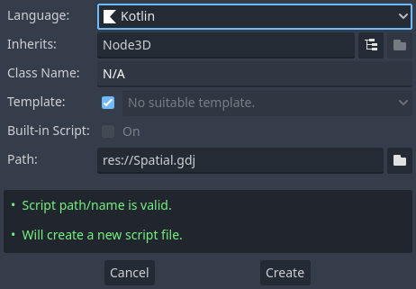

Let's create a file `src/main/kotlin/com/yourcompany/game/Simple.kt` with the following content:

```kotlin
package com.yourcompany.game

import godot.Node3D
import godot.annotation.GodotScript
import godot.annotation.Register
import godot.global.GD

@GodotScript
class Simple: Node3D() {

    @Register
    override fun _ready() {
        GD.print("Hello world!")
    }
}
```

The [classes](../user-guide/classes.md) section covers in details what we did here, but for now `@GodotScript` will register the class to Godot. Now we can trigger a build.

```shell
./gradlew build
``` 

Once the build completes, you will be able to use your class in Godot. Simply attach the generated `gdj` file (By default, generated in the `gdj/` directory at the root of the project. For more details, read [user guide](../user-guide/api-differences.md#registration-files-gdj)) to a node like you would do in GDScript. If you rebuild the project while the editor is open, your classes will be reloaded automatically in Godot and you can use them.



!!! info
    As Kotlin is a compiled language you can only use newly created classes after you have built them, otherwise, Godot will not be able to find them.


## Final project structure

The final filesystem project should look like this:

```
~/Dev/Workspace/kotlin-godot-demo tree
.
├── build
│   └── libs
├── build.gradle.kts
├── gdj
├── gradle
│   └── wrapper
│       ├── gradle-wrapper.jar
│       └── gradle-wrapper.properties
├── gradlew
├── gradlew.bat
├── icon.svg
├── kotlin-godot-demo.iml
├── project.godot
├── settings.gradle.kts
└── src
    └── main
        └── kotlin
            └── com
                └── utopiarise
                    └── demo
                        └── Simple.kt

12 directories, 10 files
```