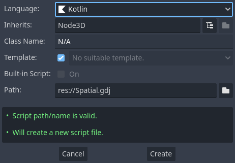

# Your first class

Let's create a class that prints a message when its node enters the scene
tree.

/// tab | Kotlin

Create `src/main/kotlin/com/yourcompany/game/Player.kt`:

```kotlin
package com.yourcompany.game

import godot.annotation.Script
import godot.api.Node
import godot.global.GD

@Script
class Player : Node() {
    override fun _ready() {
        GD.print("Hello from Kotlin")
    }
}
```

///

/// tab | Java

Create `src/main/java/com/yourcompany/game/Player.java`:

```java
package com.yourcompany.game;

import godot.annotation.Script;
import godot.api.Node;
import godot.global.GD;

@Script
public class Player extends Node {
    @Override
    public void _ready() {
        GD.print("Hello from Java");
    }
}
```

///

/// tab | Scala

Create `src/main/scala/com/yourcompany/game/Player.scala`:

```scala
package com.yourcompany.game

import godot.annotation.Script
import godot.api.Node
import godot.global.GD

@Script
class Player extends Node {
  override def _ready(): Unit = {
    GD.print("Hello from Scala")
  }
}
```

///

This small example already shows the main building blocks:

- `@Script` makes the class available to Godot.
- Inheriting `Node` makes it a Godot script class.
- Overriding `_ready()` runs code when the node enters the scene tree.
- `GD.print(...)` writes to the Godot output.

Now trigger a build:

```shell
./gradlew build
```

After the build, attach the source file (`Player.kt`, `Player.java`, or
`Player.scala`) to a node as you would attach a GDScript. Its filename, without
the extension, must match the simple name of the script class: `Player.kt`
declares `Player`.

If you rebuild while the editor is open, your classes are reloaded
automatically.



!!! info
    JVM languages are compiled. Godot cannot use a newly created or changed
    class until its build succeeds.

The [signals and callables](../user-guide/signals_and_callables.md) guide is
a good next step once this class works. For complete control over which
declarations Godot sees, read the
[registration guide](../user-guide/advanced/registration-logic.md).

## Final project structure

Depending on the language, the source file belongs in one of these roots:

/// tab | Kotlin

```text
src/
  main/
    kotlin/
      com/
        yourcompany/
          game/
            Player.kt
```

///

/// tab | Java

```text
src/
  main/
    java/
      com/
        yourcompany/
          game/
            Player.java
```

///

/// tab | Scala

```text
src/
  main/
    scala/
      com/
        yourcompany/
          game/
            Player.scala
```

///
