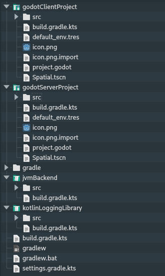
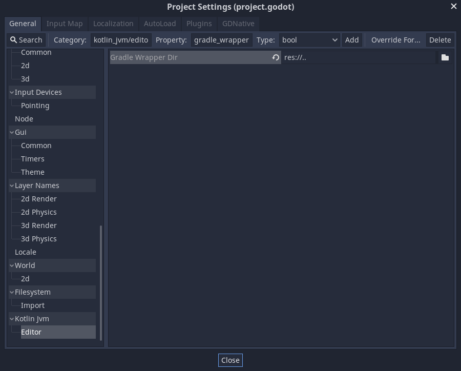

Sometimes a project setup is more advanced and requires to have the Godot project as a module inside a bigger Kotlin project. For example consider the following project setup:

  

The Godot editor does not know anything about the project structure in parent directories. Hence it cannot find the gradle wrapper as it only looks inside it's own directory.

To accommodate for more complicated project setups, you can define the path to the gradle wrapper in the project settings.
The following example would fit the projects structure above where the Gradle wrapper is located a directory above the Godot project:

