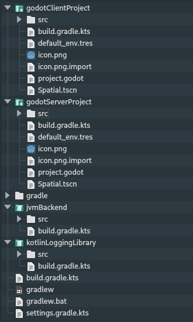
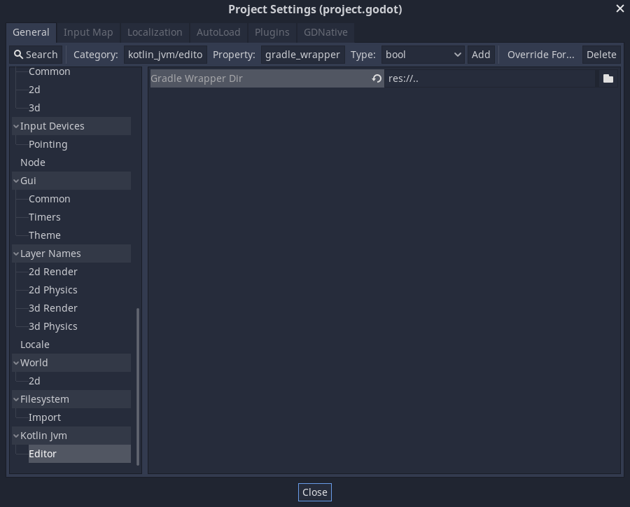

# Gradle plugin configuration

This page is the reference for configuring `com.utopia-rise.godot-kotlin-jvm`.

Most settings live in the `godot { ... }` block in `build.gradle.kts`.
Two related topics also live here because users usually look for them alongside plugin setup:

- custom Kotlin source directories
- Gradle wrapper path in the Godot editor

The plugin also works well with Gradle performance features such as parallel execution and configuration cache.

## Quick example

```kotlin
import godot.entrygenerator.settings.RegisteredNameMode
import godot.entrygenerator.settings.RegistrationFileLayoutMode
import godot.gradle.GodotLanguage

godot {
    languages.set(setOf(GodotLanguage.KOTLIN))
    javaVersion.set(17)

    godotProjectDirectory.set(file("."))
    registrationFilesDirectory.set(file("gdj"))
    registrationFilesLayoutMode.set(RegistrationFileLayoutMode.FLAT)
    registrationNameMode.set(RegisteredNameMode.SIMPLE_NAME)
}
```

## Recommended Gradle performance settings

For day-to-day project builds, these Gradle properties are a good default:

```properties
org.gradle.parallel=true
org.gradle.configuration-cache=true
```

These are regular Gradle settings, so they belong in `gradle.properties`, not in the `godot { ... }` block.

## Build languages and toolchains

These settings control which JVM languages participate in the initial compilation pass, and which Java/Kotlin/Scala versions are used for the build.

### `languages`

Controls which JVM source languages participate in the initial `classes` compilation pass.

Default:

- Kotlin
- Java
- Scala

Example:

```kotlin
import godot.gradle.GodotLanguage

godot {
    languages.set(setOf(GodotLanguage.KOTLIN, GodotLanguage.JAVA))
}
```

Effect:

- `compileKotlin` only runs when `KOTLIN` is enabled
- `compileJava` only runs when `JAVA` is enabled
- `compileScala` only runs when `SCALA` is enabled
- Scala plugin/runtime wiring is only added when `SCALA` is enabled

### `javaVersion`

Configures the Java and Kotlin toolchains used for compilation.

Default:

- `11`

Example:

```kotlin
godot {
    javaVersion.set(17)
}
```

Rule:

- must be at least JDK `11`

### `kotlinVersion`

Expected Kotlin Gradle plugin version for the build.

Default:

- `2.3.20`

Example:

```kotlin
godot {
    kotlinVersion.set("2.2.21")
}
```

Rules:

- must be at least `2.3.20` for the current Godot Kotlin/JVM release
- if you keep the default, the Godot plugin applies Kotlin `2.3.20` automatically
- if you override it, you should also apply `org.jetbrains.kotlin.jvm` explicitly with the same version before `com.utopia-rise.godot-kotlin-jvm`

Example with explicit override:

```kotlin
plugins {
    kotlin("jvm") version "2.2.21"
    id("com.utopia-rise.godot-kotlin-jvm") version "YOUR_GODOT_KOTLIN_VERSION"
}

godot {
    kotlinVersion.set("2.2.21")
}
```

### `scalaVersion`

Scala version used when Scala support is enabled.

Default:

- `3.6.3`

Example:

```kotlin
godot {
    scalaVersion.set("3.6.3")
}
```

Rules:

- only matters when `languages` contains `GodotLanguage.SCALA`
- must be at least Scala `3.0.0`

## Godot project layout and registration output

These settings control where the plugin looks for the Godot project and where it writes `.gdj` registration files.

### `godotProjectDirectory`

Directory that contains `project.godot`.

Default:

- the current Gradle project directory

Use this when the Gradle project lives in a subdirectory:

```kotlin
godot {
    godotProjectDirectory.set(file(".."))
}
```

### `registrationFilesDirectory`

Base directory where newly created `.gdj` registration files are written.

Default:

- `<godotProjectDirectory>/gdj`

Example:

```kotlin
godot {
    registrationFilesDirectory.set(file("custom-gdj"))
}
```

### `registrationFilesLayoutMode`

Controls how `.gdj` files are laid out inside each project directory.

Values:

- `RegistrationFileLayoutMode.FLAT`
- `RegistrationFileLayoutMode.HIERARCHICAL`

Example:

```kotlin
import godot.entrygenerator.settings.RegistrationFileLayoutMode

godot {
    registrationFilesLayoutMode.set(RegistrationFileLayoutMode.HIERARCHICAL)
}
```

### `registrationFilesIndentation`

Controls the indentation used inside generated `.gdj` files.

Values:

- `RegistrationFileIndentation.SPACE`
- `RegistrationFileIndentation.TAB`

Default:

- `RegistrationFileIndentation.SPACE`

Example:

```kotlin
import godot.entrygenerator.settings.RegistrationFileIndentation

godot {
    registrationFilesIndentation.set(RegistrationFileIndentation.TAB)
}
```

### `registrationNameMode`

Controls how default registered names are computed when `@RegisterClass` does not provide a custom name.

Values:

- `RegisteredNameMode.SIMPLE_NAME`
- `RegisteredNameMode.FQ_NAME`
- `RegisteredNameMode.PROJECT_PREFIX`

Example:

```kotlin
import godot.entrygenerator.settings.RegisteredNameMode

godot {
    registrationNameMode.set(RegisteredNameMode.FQ_NAME)
}
```

## Packaging and optional runtime features

These settings affect how the project is packaged and which optional runtime helpers are added.

### `isLibrary`

Marks the project as a reusable Godot Kotlin/JVM library instead of a runnable Godot project.

Example:

```kotlin
godot {
    isLibrary.set(true)
}
```

When enabled, the plugin:

- keeps compile setup and Godot dependencies
- skips entry scanning and `.gdj` generation for the local project
- skips the runnable-project packaging flow
- leaves a regular library jar as the final artifact

### `isGodotCoroutinesEnabled`

Adds the Godot coroutine library and Kotlin coroutines dependency.

Example:

```kotlin
godot {
    isGodotCoroutinesEnabled.set(true)
}
```

## Android build inputs

These settings matter when you invoke:

- `buildAndroid`
- `buildAndroidRelease`

The Android export tasks are compatible with configuration cache, so `buildAndroid` and lower-level Android packaging tasks can be run with `--configuration-cache`.

### `d8ToolPath`

Path to the `d8` executable used for dex generation.

```kotlin
godot {
    d8ToolPath.set(File("${System.getenv("ANDROID_SDK_ROOT")}/build-tools/36.0.0/d8"))
}
```

### `androidCompileSdkDirectory`

Path to the Android platform directory used for compilation.

```kotlin
godot {
    androidCompileSdkDirectory.set(File("${System.getenv("ANDROID_SDK_ROOT")}/platforms/android-36"))
}
```

### `androidMinApiLevel`

Minimum Android API level passed to `d8`.

```kotlin
godot {
    androidMinApiLevel.set(21)
}
```

## GraalVM and iOS build inputs

These settings matter when you invoke:

- `buildGraalNativeImage`
- `buildGraalNativeImageRelease`
- `buildIOS`
- `buildIOSRelease`

The desktop GraalVM and iOS export tasks are also compatible with configuration cache.

### `graalVmHomeDirectory`

Path to the GraalVM home directory.

```kotlin
godot {
    graalVmHomeDirectory.set(File(System.getenv("GRAALVM_HOME")))
}
```

### `windowsDeveloperVcVarsPath`

Windows-only path to the Visual Studio VCVARS script used by native-image builds.

```kotlin
godot {
    windowsDeveloperVcVarsPath.set(File(System.getenv("VC_VARS_PATH")))
}
```

### `additionalGraalJniConfigurationFiles`

Additional JNI configuration files passed to native-image.

```kotlin
godot {
    additionalGraalJniConfigurationFiles.set(
        arrayOf("graal/jni-config.json")
    )
}
```

### `additionalGraalReflectionConfigurationFiles`

Additional reflection configuration files passed to native-image.

```kotlin
godot {
    additionalGraalReflectionConfigurationFiles.set(
        arrayOf("graal/reflect-config.json")
    )
}
```

### `additionalGraalResourceConfigurationFiles`

Additional resource configuration files passed to native-image.

```kotlin
godot {
    additionalGraalResourceConfigurationFiles.set(
        arrayOf("graal/resource-config.json")
    )
}
```

### `isGraalNativeImageVerboseEnabled`

Turns on verbose mode for native-image generation.

```kotlin
godot {
    isGraalNativeImageVerboseEnabled.set(true)
}
```

## Related Gradle and editor configuration

These are often configured together with the plugin, but they are not `godot { ... }` properties.

### Custom source directories

If you want Gradle to compile sources from a non-default Kotlin source directory, configure the regular Kotlin source set:

```kotlin
kotlin.sourceSets.main {
    kotlin.srcDirs("scripts")
}
```

This is standard Gradle/Kotlin source-set configuration.

### Gradle wrapper path in the Godot editor

Sometimes the Godot project is nested inside a larger repository and the Gradle wrapper lives in a parent directory:



In that case, the Godot editor may not find the wrapper automatically because it only looks inside the Godot project directory.

To support that layout, set the Gradle wrapper path from the Godot project settings:


