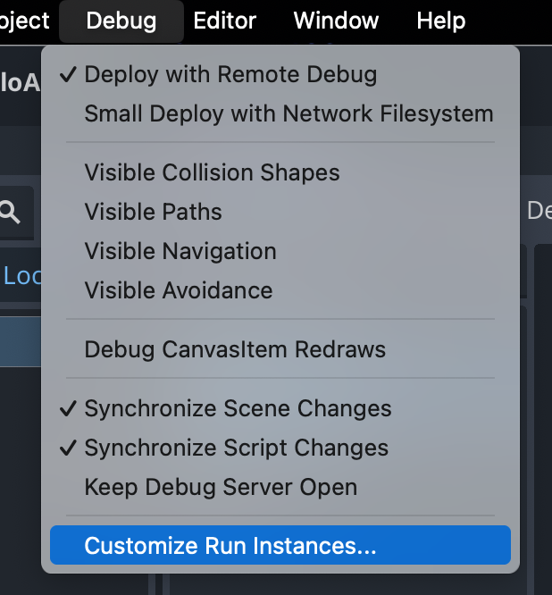

## Prerequisites

In order to debug your code using an embedded JRE, make sure to include the following modules:

- `jdk.jdwp.agent`

!!! info
    Example for AMD64 systems: `jlink --add-modules java.base,java.logging,jdk.jdwp.agent --output jvm/jre-amd64-linux` (make sure to swap `linux` to your platform!)  
    Example for ARM64 systems: `jlink --add-modules java.base,java.logging,jdk.jdwp.agent --output jvm/jre-arm64-macos` (make sure to swap `macos` to your platform!)

If you're still using the JDK installed on your system though, you don't need to do this.

## Run and attach a Remote Debugger

Breakpoint based debugging is available via the remote debugger.

#### 1. Customize Run Instances in Godot

Open up the **Customize Run Instances** dialog from the **Debug** menu in Godot



#### 2. Specify the arguments

In the **Main Run Args**, you should specify your commandline options. In the example below we use port `5005` by specifying: `--jvm-debug-port=5005`

!!! info
    If you specify either `--jvm-debug-port` or `--jvm-debug-address` the execution of the game will suspend until you attach a remote debugger. You can configure this behaviour by specifying `--wait-for-debugger=true` or `--wait-for-debugger=false`


#### 3. Create a new configuration in IntelliJ

Create a new **Configuration** using **Remote JVM Debug**


#### 4. Setup the new configuration in IntelliJ

Use the same port as you used in step 2, in our case `5005`


#### 5. Set a breakpoint in IntelliJ


#### 6. Launch the game in Godot.

Depending on your flags (`--wait-for-debugger`), the game will suspend until you attached the remote debugger from IntelliJ

#### 7. Run the Debug Game configuration

Run the **Debug Game** configuration you made earlier in IntelliJ


#### 8. Breakpoint

IntelliJ will now automatically pause when the breakpoint is hit


## Write debug code

You can add code only for debug version of your project, by using `GodotJvmDefinitions`.
When building your project with the release flag, those ifs are going to be automatically removed from your code, not even the condition check is left.

Example:

```kotlin
if (GodotJvmDefinitions.DEBUG) {
    // ...
}
```
