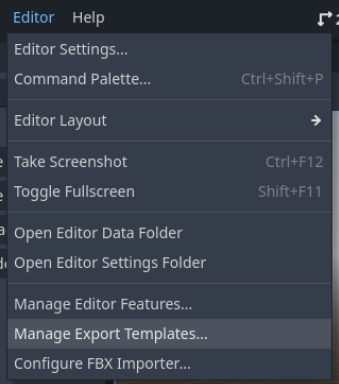
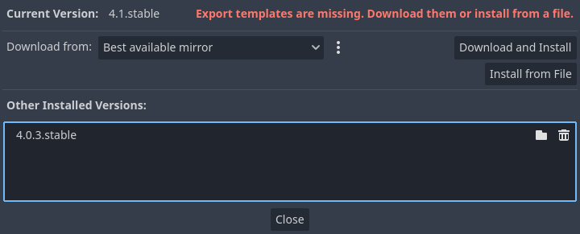
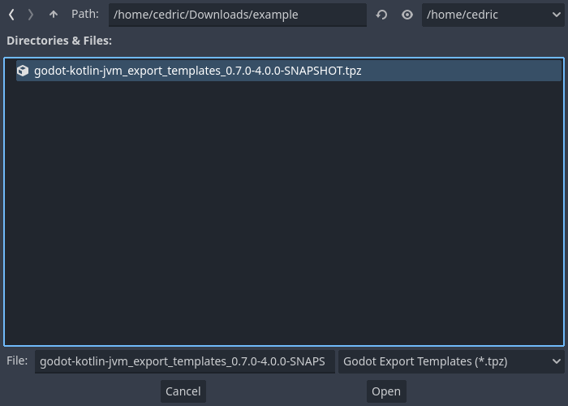

!!!note warning
    In order for your exported game to work, you need our custom export templates. Download them from the corresponding [GitHub release](https://github.com/utopia-rise/godot-kotlin-jvm/releases). 


To export your game, you need to add our export templates to Godot. After you've downloaded them, open the export template manager in Godot and select `Install from File`:





After the export templates have been added, you can export your game. Your game `jar` will be included in `pck`.
On desktop platforms, this also copies the JRE folder of your project in the exported game folder.

!!!danger
    The official export templates from Godot will not work! You have to use our export templates or build your own! Therefore, you cannot just hit the "Download and Install" button in the export template manager!


## Requirements

To export your game, you need to have an embedded JRE created. Run the following command within your project's root.

- amd64 systems:
    ```shell
    jlink --add-modules java.base,java.logging --output jre-amd64
    ```
- arm64 systems:
    ```shell
    jlink --add-modules java.base,java.logging --output jre-arm64
    ```

The above command will create a very minimal JVM, if you need extra features you can include the following modules:

- `jdk.jdwp.agent` to enable remote debugging
- `jdk.management.agent` to enable JMX.

*Special note for MacOS*: To create a universal app, you'll need both amd64 and arm64 JRE. You can create an amd64 JRE
by using `jlink` with rosetta and an amd64 JDK on an arm64 MacOS.

!!!warning Correct JRE for desktops
    For desktop exports you need to make exports based on the platform you're on, as exporting will copy the generated jre folder to
    your export. An MacOS JRE will not work on Windows, so you'll need a Windows host to export for Windows.

## Specifics

`godot-bootstrap.jar` and `main.jar` are copied into `pck` during the export process.
As a real file path is needed to handle them, they are copied on the first game version start
from `res://` to `user://` (we check if they exist and also check the md5 hash) to only update when needed.
Don't forget to remove them when writing an uninstaller for your game.

## Android

!!! warning
    If you plan to export your game to android, make sure the libraries you use, are actually compatible with android.

In order to build for Android, set the `isAndroidExportEnabled` flag to `true` in your build file.

=== "build.gradke.kts"
    ```kt
    godot {
        isAndroidExportEnabled.set(true)
    }
    ```

On Android, we do not embed a JVM, we use the existing VM provided by the OS. In order for your game to load the necessary JAR files,
they need to be converted into `.dex` format. Our Gradle plugin will handle this for you, but you need to fulfill the following requirements:

!!! warning
    Ensure you have the build tools version 35 or newer installed!

- Android SDK installed (currently build-tools 35 is required!).
- `d8` tool resolvable by setting the `d8ToolPath` to the file path of `d8`:
    ```kt
    godot {
        d8ToolPath = File("${System.getenv("ANDROID_SDK_ROOT")}/build-tools/35.0.0/d8")
    }
    ```

- Setting the `androidCompileSdkDir` to your target SDK version (most of the time, you want to set it to the newest version available):
    ```kt
    godot {
        androidCompileSdkDir = File("${System.getenv("ANDROID_SDK_ROOT")}/platforms/android-35")
    }
    ```

- Setting the `androidMinApi` (equivalent to `--min-api` argument of `d8` tool), default is `21`:
    ```kt
    godot {
        androidMinApi = 22
    }
    ```

!!!danger
    Similar to the desktop targets, the game copies the needed jar files to the `user://` directory upon first execution or if the files have changed. On Android this is the applications `files` folder. If you do IO operations on Android, never empty the whole `files` folder! Only delete what you have added or exclude the following two files when clearing the `files` folder: `godot-bootstrap-dex.jar` and `main-dex.jar`.

## GraalVM Native Image

!!! warning
    GraalVM Native Image is an advanced feature and requires a lot of work to support. Especially if you rely on many third party libraries.

In order to build for graalvm, follow `GraalVM native-image` section in [advanced user guide](./advanced/graal-vm-native-image.md).

The `main.jar` and `godot-bootstrap.jar` are compiled into a single `usercode` shared library is copied into `pck` during the export process. Similar to the regular export versions, the `usercode` shared library is copied to the `user://` dir. Don't forget to delete it when creating an uninstaller.

On desktop, you can add the feature `export-graal-native-image` to make your game run on GraalVM Native Image. 
You can also use `export-all-jvm` to export both the JVM and the Native Image. By default, your export will use the same mode as the one used by the editor that exported it, but you can easily override this by using a command-line argument when launching.

## iOS

!!! warning
    With this export you don't have a choice regarding JVM version you use. Please use [GraalVM 23.1.3](https://download.oracle.com/graalvm/21/latest/graalvm-jdk-21_macos-aarch64_bin.tar.gz).

Additionally, to the regular GraalVM configuration mentioned above, add the following in `build.gradle.kts`:

```kotlin
godot {
    graalVmDirectory.set(File("Path to your graalVM install")) // or setup GRAALVM_HOME environment variable.
    isIOSExportEnabled.set(true)
}
```
